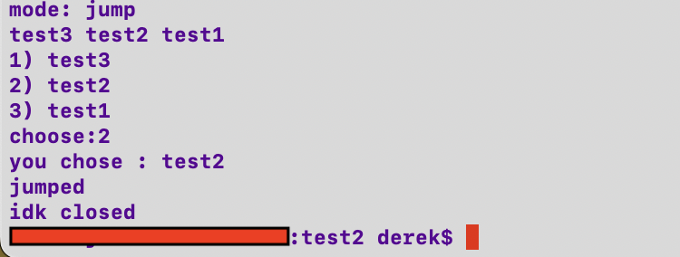
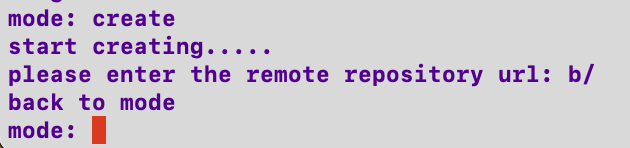

# idkgit

idkgit is a tool that allows users of macOS/Linux to conveniently do git actions to thier projects.

## Requirements

Before you begin, ensure you have met the following requirements:

* You have a `Linux/Mac` machine that is able to execute bash scripts
* You have read the instructions for using idkgit

## How to install idkgit

To install idkgit follow these steps:

Linux and macOS:

1.
```
git clone https://github.com/deeeelin/idkgit.git <folder path>
```

2.
enter `$SHLVL` in terminal and make sure the output is 1 , else restart terminal 

3.
```
<folder path>/start.bash
```
4.
restart your terminal

## How to use idkgit

Enter `idk` to execute idkgit,and you will be in "select mode session".

In select mode session , you can enter:

`clone` or `cl` to clone repositories


`init` or `i` to initialize git to your project


`create` or `cr` to make idkgit track a project your working


`list` or `l` to see current project that idkgit is tracking


`setcom` or `s` to set commit message for pushing


`push` or `ph` to push a project , `pull` or `pl` to pull a project:


   if your "proj name" is `all` then it will automaitcally push/pull all projects that idkgit is tracking,and 
   the commit message will be the time of committing in default.


`jump` or `j` to change to one of a directory that idkgit is tracking,and automatically close idkgit



`delete` or `d` to cancel tracking a project


`out` or `o` to close idkgit (only works when you're in select mode session).


---inside all mode mentioned above ,enter `b/` to jump back to "select mode session"-----



## Very welcome to make contributes to idkgit ,or contact me to provide recommends for this project,very appreciate

To contribute to this project:

1. Fork this repository.
2. Create branch
3. Make changes and commit them
4. Push to your github
5. Create pull request.
6. Send a message to me via email

## List of contributors

* [@deeeelin](https://github.com/deeeelin) 

## Contact me

If you want to contact me you can reach me at <dereklin100503@gmail.com>

## MIT License

This project uses the following license: [MIT License](https://choosealicense.com/licenses/mit/#).
