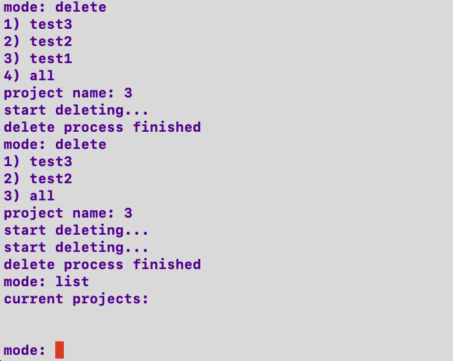
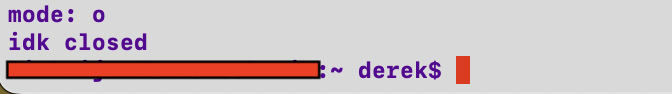

# idkgit

idkgit is a tool that allows users with bash shell to conveniently do git actions to thier projects.

(Correctness of this project are only tested in macos recently !)

## Requirements

Before you begin, ensure you have met the following requirements:

* You have a device (recommended using mac) that is able to execute bash scripts
* You have read the instructions for using idkgit

## How to install idkgit

To install idkgit follow these steps:

1. Clone the repo : 
```
git clone https://github.com/deeeelin/idkgit.git <folder path>
```
, or just download the zip file . 

2. Enter `$SHLVL` in terminal and make sure the output is 1 , else restart terminal 

3. Execute start.bash

4. Restart your terminal

## How to use idkgit

*Please go through the following steps by doing it on your own computer~*

Enter `idk` to execute idkgit,and you will be in "select mode session".

In select mode session , you can enter:

* `clone` or `cl` to clone repositories

ex : cloning repository of Rust into a folder "Rust_clone" under desktop 


* `init` or `i` to initialize git to your project

ex : initialize a directory "test2" 


* `create` or `cr` to make idkgit track a project your working

ex : track a project "test1"


* `list` or `l` to see current project that idkgit is tracking


* `setcom` or `s` to set commit message for pushing

ex : set commit message as "little updates from deeeelin"


* `push` or `ph` to push a project , `pull` or `pl` to pull a project:

ex : pull main branch of test1 from github to it's master branch at local


ex : push master branch of test2 at local to it's main branch on github


   if your "proj name" is `all` then it will automaitcally push/pull all projects that idkgit is tracking , by referencing the same branch that is pushed/pulled previously of each project . 
   


* `jump` or `j` to change to one of a directory that idkgit is tracking,and automatically close idkgit

ex : jump to directory of test2


* `delete` or `d` to cancel tracking a project

ex : cancel tracking "test1" , then cancel tracking all of the project.



* `out` or `o` to close idkgit (only works when you're in select mode session).



* inside all mode mentioned above ,enter `b/` to jump back to "select mode session"


## Very welcome to make contributes to idkgit ,or contact me to provide recommends for this project,very appreciate

To contribute to this project:

1. Fork this repository.
2. Create branch
3. Make changes and commit them
4. Push to your github
5. Create pull request.
6. Send a message to me via email

## List of contributors

* [@deeeelin](https://github.com/deeeelin) 

## Contact me

If you want to contact me you can reach me at <dereklin100503@gmail.com>

## MIT License

This project uses the following license: [MIT License](https://choosealicense.com/licenses/mit/#).
